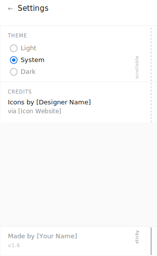

# Settings Screen — Implementation Plan

## Summary
Replace the existing theme toggle and credits dialog with a dedicated Settings screen. Add a "System" theme option that reacts live to OS changes.

---

## 1. Data Layer

### ThemePreference enum
Create a new enum to replace the existing boolean:
```kotlin
enum class ThemePreference { LIGHT, SYSTEM, DARK }
```

### DataStore
- Replace the existing `isDarkMode` boolean with a `ThemePreference` enum value (store as string or int)
- Update `UserPreferencesRepository` interface and impl accordingly
- Update `MainActivityViewModel` to expose `ThemePreference` instead of `Boolean`

---

## 2. Theme Logic

In `MainActivity`, replace the current dark mode logic with:
```kotlin
val isDark = when (themePreference) {
    ThemePreference.LIGHT -> false
    ThemePreference.DARK -> true
    ThemePreference.SYSTEM -> isSystemInDarkTheme()
}
```
`isSystemInDarkTheme()` is reactive — Compose will recompose automatically when the OS theme changes.

---

## 3. Navigation

### Remove
- "Theme" overflow menu entry
- "Credits" overflow menu entry
- Credits dialog

### Add
- Settings icon in the top app bar (replaces both entries, 1 tap)
- New Voyager `Screen`: `SettingsScreen`
- New Voyager `ScreenModel`: `SettingsScreenModel`

---

## 4. SettingsScreen UI

### Structure
- Top bar with back arrow + "Settings" title
- Scrollable content area (`verticalScroll` or `LazyColumn`)
    - **Theme section** — section header + 3 radio buttons: Light, System, Dark
    - **Credits section** — section header + icon designer name/attribution
    - Divider after Credits section
- Sticky footer (always visible, outside scroll)
    - Divider above footer
    - "Made by [Your Name]" + "v1.6"

### Theme selection logic
- Radio buttons bound to `ThemePreference`
- On selection → update DataStore via `SettingsScreenModel`
- `MainActivityViewModel` observes the change and recomposes the theme immediately

---

## 5. Files to Create
- `SettingsScreen.kt`
- `SettingsScreenModel.kt`

## 6. Files to Modify
- `UserPreferencesRepository` + impl — swap boolean for enum
- `MainActivityViewModel` — expose `ThemePreference`
- `MainActivity` — update theme logic
- Whichever screen hosts the top bar — replace overflow menu entries with settings icon

---

## Notes
- `isSystemInDarkTheme()` is sufficient for live system theme detection — no additional listeners needed
- Scrollable area uses `weight(1f)` + footer outside scroll to achieve sticky footer behavior
- Branch `adding-system-light-dark-theme` exists but is considered irrelevant — start fresh

---

## Mockups

### Top Bar


### Settings Screen
